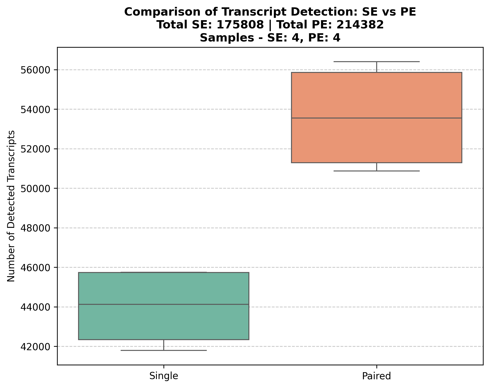

# **Transcriptome Counts Module**

## **Overview**

I developed this module to **extract transcript counts from Kallisto quantification results** and generate a **comparative boxplot** for Single-End (SE) and Paired-End (PE) transcript detection. This step helps visualize the impact of sequencing strategy on transcript quantification and prepares the data for **differential expression analysis (DEA).**

## **What This Module Does?**
1. Extracts the number of detected transcripts from **Kallisto quantification outputs** (SE & PE).
2. Creates a **transcript count matrix** (`se_vs_pe_transcript_counts.tsv`).
3. Generates a **boxplot** (`se_vs_pe_boxplot.png`) comparing SE vs. PE transcript detection.

This workflow **automatically handles SE, PE, or both input types** based on the provided parameters. It ensures that outputs are correctly labeled and processed without requiring separate workflows.

---

## **Why Use TPM Instead of Estimated Counts?**
I decided to use **Transcripts Per Million (TPM)** instead of estimated counts because:
- TPM is **normalized** for sequencing depth and gene length, making comparisons more accurate.
- Estimated counts can be biased due to library size differences, whereas TPM allows direct sample-to-sample comparisons.

---

## **Transcriptome Counts Module is Fully Dockerized**
This module **does not require manual installation of dependencies**.

Instead, **I created a public Docker container** (`pablosolar/kallisto_counts_boxplot:v1.0.0`) to ensure **consistency across different environments** and prevent dependency issues.

This is specified in `nextflow.config`:

```bash
process {
    withName: transcriptome_counts_app {
        container = "pablosolar/kallisto_counts_boxplot:v1.0.0"
    }
}
```

When running the module, simply add `-with-docker` to ensure execution inside the container:

```bash
nextflow run main.nf -params-file test_input.json -with-docker
```

---

## **Input Parameters**

This module requires the following input parameters:

| Parameter                | Type   | Description                                                   |
|--------------------------|--------|---------------------------------------------------------------|
| `se_abundance_tsvs`      | list   | List of SE abundance files (`sample_id_se_abundance.tsv`)    |
| `pe_abundance_tsvs`      | list   | List of PE abundance files (`sample_id_pe_abundance.tsv`)    |
| `results_dir`            | string | Path where output results will be stored                     |

---

## **How to Run This Module**

### **Running Normally (Extract Counts and Generate Boxplot)**
To extract transcript counts and generate the boxplot, I run:

```bash
nextflow run main.nf -params-file test_input.json -with-docker
```

#### **Example of `test_input.json`**
Here is the test input JSON file I use for running the module normally:

```json
{
    "se_abundance_tsvs": [
        "/path/to/results/transcriptome_quantification/single_end/Treated1_se_abundance.tsv",
        "/path/to/results/transcriptome_quantification/single_end/Treated2_se_abundance.tsv"
    ],
    "pe_abundance_tsvs": [
        "/path/to/results/transcriptome_quantification/paired_end/Treated1_pe_abundance.tsv",
        "/path/to/results/transcriptome_quantification/paired_end/Treated2_pe_abundance.tsv"
    ],
    "results_dir": "results"
}
```

---

### **Running in Stub Mode (Simulated Execution)**
To test without extracting real counts, I use stub mode:

```bash
nextflow run main.nf -stub-run -params-file stub/stub_test_input.json
```

#### **Example of `stub_test_input.json`**
This is the stub test input JSON file for validating module execution:

```json
{
    "se_abundance_tsvs": [
        "/path/to/stub/transcriptome_quantification/single_end/Stub_Sample1_se_abundance.tsv"
    ],
    "pe_abundance_tsvs": [
        "/path/to/stub/transcriptome_quantification/paired_end/Stub_Sample1_pe_abundance.tsv"
    ],
    "results_dir": "stub"
}
```

---

## **Expected Outputs**

| Mode       | Output File Path                                       |
|------------|--------------------------------------------------------|
| Normal     | `/path/to/results/transcriptome_counts/se_vs_pe_transcript_counts.tsv` |
| Normal     | `/path/to/results/transcriptome_counts/se_vs_pe_boxplot.png` (if both SE & PE exist) |
| Stub Mode  | `stub/transcriptome_counts/se_vs_pe_transcript_counts.tsv` |
| Stub Mode  | `stub/transcriptome_counts/se_vs_pe_boxplot.png` (if both SE & PE exist) |

---

### **Example Output**

#### **Table: Extracted Transcript Counts**

| Sample      | Mode-End | Detected_Transcripts |
|------------|---------|---------------------|
| Treated1   | Single  | 42525               |
| Treated1   | Paired  | 50877               |
| Untreated1 | Single  | 41799               |
| Untreated1 | Paired  | 51423               |
| Treated2   | Single  | 45739               |
| Treated2   | Paired  | 55677               |
| Untreated2 | Single  | 45745               |
| Untreated2 | Paired  | 56405               |

#### **Generated Boxplot**


After execution, the **quantification results** are stored in the directory specified by `results_dir`.

---

## **References**
I based my approach on these references:
- [Kallisto GitHub](https://github.com/pachterlab/kallisto)  
- [Kallisto official documentation](https://pachterlab.github.io/kallisto/)
- Bray, N.L., Pimentel, H., Melsted, P., & Pachter, L. (2016). *Near-optimal probabilistic RNA-seq quantification.* *Nature Biotechnology*, 34(5), 525-527.
---